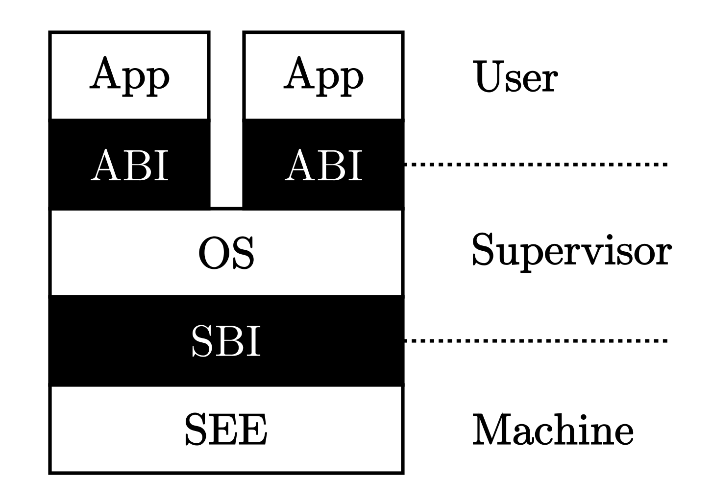

### 今日目标

第二章、第三章实验指导书阅读记录，第三章代码跑通

### 今日碎碎念

又是不想睡觉硬拖着度过的一个晚上，到六点才睡，兜兜转转来到实验室又是十二点。直到直到数值分析考试提前才有了确实的焦虑心情：“你真的没什么时间了。”之前被找工作摧残的心该打起精神把眼前的任务做完了，总之先度过这个中期吧。

### 实验指导书chap1

> 构建裸机运行时执行环境

1. 首先，应用程序的裸机硬件系统是啥样子的？其次，系统在做这些初始化工作之前处于什么状态；最后，在做完初始化工作也就是即将执行 main 函数之前又处于什么状态

VIRT_DRAM：DRAM的内存起始地址是 0x80000000

VIRT_UART0：串口相关的寄存器起始地址是 0x10000000

2. 链接文件ld的分析

`. `表示当前地址，链接器会从它指向的位置开始往下放置从输入的目标文件中收集来的段。

`_start` 是一个符号（Symbol），符号在汇编程序中代表一个地址。_start就像C程序的main函数一样特殊，是整个程序的入口

`.globl`指示告诉汇编器，符号要被链接器用到，所以要在目标文件的符号表中标记它是一个全局符号

3. 设置栈的布局（栈和内存布局的关系？）

汇编程序中以.开头的名称并不是指令的助记符，而是给汇编器一些特殊指示，称为汇编指示。

> 附录C：介绍SBI

SBI是RISC-V的一种底层规范，负责引导启动RISC-V下的操作系统。并常驻后台，为操作系统提供一系列二进制接口，以便其获取和操作硬件信息。

RustSBI项目的目标是，制作一个从固件启动的最小Rust语言SBI实现，为可能的复杂实现提供参考和支持

### 实验指导书chap2

批处理系统的核心思想是：将多个程序打包到一起输入计算机。而当一个程序运行结束后，计算机会自动加载下一个程序到内存并开始执行。

`batch.c` 实现一个简单的批处理系统

`link_app.S` 将应用作为一个数据段链接到内核

首先把本来相对松散的应用程序执行代码和操作系统执行代码连接在一起，方便qemu把代码加载到内存里。把应用程序执行文件从ELF执行文件格式变成Binary格式，通过辅助脚本 `（？）`转变变成 link_app.S 这个汇编文件的一部分

> 特权级的软硬件协同设计

传统的call指令会绕过硬件的特权级检查，所以使用 `ecall` 指令(具有用户态到内核态的执行环境切换能力的函数调用指令)

运行在 M 模式上的软件被称为 `监督模式执行环境` (SEE)

> 实现批处理操作系统

我们将应用程序的二进制文件作为内核的数据段链接到内核里面

`batch` 模块的作用：保存应用数量和各自的位置信息，以及当前执行到第几个应用了；根据应用程序位置信息，初始化好应用所需内存空间，并加载应用执行

代码逻辑：找到 link_app.S 中提供的符号 _num_app （需要看c代码确认一下）

提供了两个接口 `init` 和 `run_next_app`，init初始化全局变量APP_MANAGER

> 实现特权级的切换

`S` 特权级中与 `Trap` 相关的 控制状态寄存器，即CSR

S模式下最重要的 `sstatus` 寄存器 （到底有多重要？）

trap文件：用户程序通过 `ecall` 进入到内核状态，负责实现保存特权级切换前的寄存器和栈，然后分发处理完成系统调用，通过sret返回应用程序

（这里没精力仔细看了，以后需要了解再补吧）

执行用户程序：唯一一种能够使得 CPU 特权级下降的方法就是通过 Trap 返回系列指令，比如 `sret`，这里需要完成的工作有blabla [执行用户程序](https://rcore-os.github.io/rCore-Tutorial-Book-v3/chapter2/4trap-handling.html#ch2-app-execution)

本章练习：追加sys_write的安全性检查

### 今日总结

现在快到半夜两点了，今天的进度依然大大拖慢了，只看完了1、2章的指导书。先休息一下再起来看第三章吧，太累了。